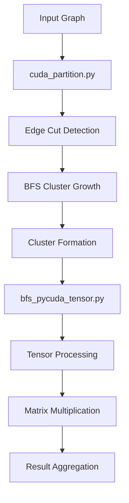

# GPU-Accelerated Graph Neural Network Computation: A Hybrid Partitioning and Processing Approach

## System Architecture Overview

The system consists of two main components working in tandem:

1. **cuda_partition.py**: Handles graph partitioning using GPU-accelerated edge-cut detection and BFS
2. **bfs_pycuda_tensor.py**: Manages tensor operations and overall computation pipeline

### Component Interaction Flow



## Key Innovations

### 1. Partition Strategy
- Uses local clustering coefficients to identify natural graph boundaries
- Employs GPU-accelerated BFS that grows away from cut points
- Maintains connectivity while optimizing for parallel processing

### 2. Memory Management
```
GPU Memory Layout:
┌────────────────┐
│ Edge Cuts      │
├────────────────┤
│ BFS Frontier   │
├────────────────┤
│ Cluster Data   │
├────────────────┤
│ Tensor Ops     │
└────────────────┘
```

### 3. Processing Pipeline

#### Phase 1: Partitioning
```python
# Key steps in partitioning:
1. Edge cut detection using clustering coefficients
2. Seed selection from cut boundaries 
3. Parallel BFS growth away from cuts
4. Dynamic cluster size management
```

#### Phase 2: Computation
```python
# Processing flow:
1. Submatrix extraction
2. Tensor core optimization
3. Parallel matrix multiplication
4. Result aggregation
```

## Technical Implementation Details

### Edge Cut Detection
- Uses atomic operations for thread-safe processing
- Employs shared memory for efficient neighbor checking
- Implements warp-level parallelism for better GPU utilization

### BFS Growth Strategy
- Queue-based frontier management
- Atomic operations for cluster assignment
- Coalesced memory access patterns

### Tensor Processing
- Utilizes GPU tensor cores when available
- Optimized sparse matrix multiplication
- Efficient memory transfer patterns

## Performance Characteristics

### Time Complexity
- Edge Cut Detection: O(E/P) where P is number of GPU processors
- BFS Growth: O((V+E)/P) 
- Matrix Multiplication: O(N×M×K/P) for sparse matrices

### Space Complexity
- Edge Cut Data: O(E)
- BFS Frontier: O(V)
- Cluster Data: O(V + E)

## Benefits Over Traditional Approaches

1. **Improved Locality**
   - Natural graph boundaries preserved
   - Reduced cross-cluster communication
   - Better cache utilization

2. **Parallel Efficiency**
   - Full GPU utilization
   - Minimized host-device transfers
   - Efficient work distribution

3. **Dynamic Adaptability**
   - Handles varying graph sizes
   - Adapts to graph structure
   - Supports incremental updates

## System Requirements

### Hardware
- CUDA-capable GPU
- Sufficient GPU memory for graph storage
- Fast host-device interconnect

### Software
- CUDA toolkit
- PyCUDA
- NetworkX/NetworKit
- Scientific Python stack

## Implementation Challenges and Solutions

1. **Memory Management**
   - Challenge: Limited GPU memory
   - Solution: Streaming computation model

2. **Load Balancing**
   - Challenge: Uneven cluster sizes
   - Solution: Dynamic cluster adjustment

3. **Synchronization**
   - Challenge: Thread contention
   - Solution: Atomic operations and shared memory

## Future Improvements

1. **Multi-GPU Support**
   - Distribute clusters across devices
   - Inter-GPU communication optimization
   - Load balancing across GPUs

2. **Dynamic Updates**
   - Incremental cluster updates
   - Partial recomputation
   - Change propagation

3. **Adaptive Parameters**
   - Auto-tuning cluster sizes
   - Dynamic threshold adjustment
   - Workload-based optimization

## Conclusion

The hybrid approach combines the benefits of graph partitioning and tensor processing, achieving:
- Efficient parallel processing
- Maintained graph structure
- Scalable computation
- Optimized memory usage

## References

1. CUDA Programming Guide
2. Graph Neural Network Architectures
3. Parallel BFS Implementations
4. Tensor Core Optimization
5. Graph Partitioning Algorithms

## Appendix: Performance Metrics

```python
Performance Characteristics:
- Partitioning Overhead: O(E/P)
- Processing Speedup: ~N× (N = number of GPU cores)
- Memory Efficiency: O(V + E) GPU memory
```

## Code Examples

### Key Kernels
```cuda
// Example of edge cut detection kernel
__global__ void find_edge_cuts(
    const int* __restrict__ row_ptr,
    const int* __restrict__ col_idx,
    float* __restrict__ edge_weights,
    int* __restrict__ cut_markers,
    const int num_nodes,
    const float threshold
) {
    // Implementation details...
}
```

### Integration Points
```python
def create_clusters_metis_bfs_gpu(adjacency_matrix, num_clusters):
    """
    Create clusters using GPU-accelerated METIS/BFS hybrid partitioning
    """
    from cuda_partition import gpu_partition_graph
    return gpu_partition_graph(adjacency_matrix, num_clusters)
```